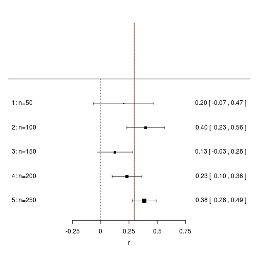
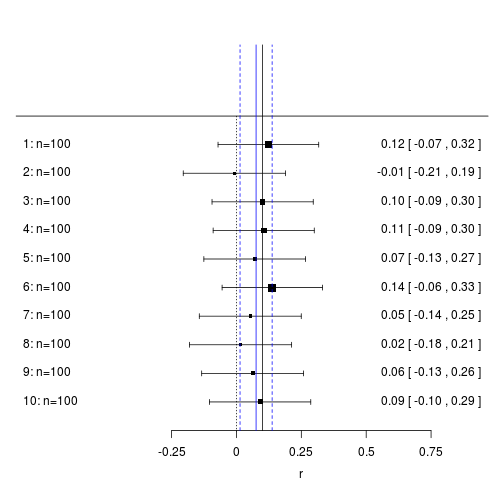

# Fixed-effects meta analysis

The following document implements the fixed effects meta-analysis procedure outlined by Borenstein, Hedges, Higgins, and Rothstein (2009) pages 65 to 97.


```r
set.seed(1234)
library(metafor)
```


# Function to generate data


```r
sample_r_data <- function(true_r, n) {
    # true_r: true population correlations n: vector of sample sizes for each
    # study
    rcor <- function(true_r, n) {
        x <- rnorm(n)
        y <- rnorm(n, true_r * x, sqrt(1 - true_r^2))
        cor(x, y)
    }
    
    # sample correlations
    Y <- sapply(n, function(X) rcor(true_r, n = X))
    
    # note that this is only approximate
    approx_variance <- function(r, n) (1 - r^2)^2/(n - 1)
    
    # Variance of correlation
    Vy <- approx_variance(Y, n)
    
    # Standard error of correlation
    SEy <- sqrt(Vy)
    
    data.frame(n, Y, Vy, SEy)
}
```


The above code can be used to generate random correlations given a true population correlation and a vector of sample sizes. It also returns approximate variances and standard errors for the correlations.


# Performing a fixed-effect meta-analysis


```r
fixed_effect_meta_analysis <- function(Y, Vy, ci = 0.95) {
    # Y: vector of effect sizes (e.g., r correlations) Vy: vector ci: scalar,
    # confidence interval: 0 < ci < 1
    stopifnot(length(Y) == length(Vy))
    
    # assign weight to each study
    W <- 1/Vy
    
    # mean effect
    M <- sum(W * Y)/sum(W)
    
    # variance of summary effect
    Vm <- 1/sum(W)
    
    # standard error of summary effect
    SEm <- sqrt(Vm)
    
    # Confidence interval for summary effect
    SEm_multiple <- abs(qnorm((1 - ci)/2))
    LLm <- M - SEm * SEm_multiple
    ULm <- M + SEm * SEm_multiple
    
    # z-value for test of null hypothesis
    Z <- M/SEm
    
    # two tailed p-value
    p <- 2 * (1 - pnorm(abs(Z)))
    
    # return values
    list(studies = cbind(Y, Vy, W, SEy = sqrt(Vy)), M = M, Vm = Vm, SEm = SEm, 
        ci = ci, ci_limits = c(LLm, ULm), test = c(Z = Z, p = p))
}
```


The above function implements the procedure for fixed-effect meta analysis outlined by the Borenstein et al (2009).  The main arguments are the vector of effect sizes $Y_i$ and the vector of variances for the effect sizes $V_{Y_{i}}$. The method is designed to work with effect sizes other than correlations such as mean differences. 


# Putting it all together
## Example 1: Five studies with increasing sample size


```r
meta1 <- sample_r_data(true_r = 0.3, n = seq(50, 250, 50))
(meta1_summary <- fixed_effect_meta_analysis(meta1$Y, meta1$Vy))
```

```
## $studies
##           Y       Vy      W     SEy
## [1,] 0.2019 0.018778  53.25 0.13703
## [2,] 0.3972 0.007166 139.55 0.08465
## [3,] 0.1253 0.006502 153.79 0.08064
## [4,] 0.2323 0.004497 222.35 0.06706
## [5,] 0.3844 0.002917 342.83 0.05401
## 
## $M
## [1] 0.2949
## 
## $Vm
## [1] 0.001097
## 
## $SEm
## [1] 0.03312
## 
## $ci
## [1] 0.95
## 
## $ci_limits
## [1] 0.2300 0.3598
## 
## $test
##     Z     p 
## 8.905 0.000 
## 
```


* This first example generates five correlations with sample sizes increasing from 50 to 250.
* The estimate of the oveall correlation, $M$, is significantly different from zero.
* Two of the sample estimates did not have (1 and 3) did not have statistically significant correlations.


```r
meta1$study_name <- paste0(1:5, ": n=", as.character(meta1$n))
forest(meta1$Y, sei = meta1$SEy, slab = meta1$study_name, xlab = "r", 
    at = seq(-0.25, 0.75, 0.25))
abline(v = 0.3)
abline(v = meta1_summary$M, col = "red", lty = 2)
```

 


* `forest` is a method in the `metafor` package which generates a forest plot.
* The plot shows how the standard error gets smaller with 
* The line in read shows the sample estimate of the true correlation, and the line in black shows the true population correlation.

## Example 2 


```r
meta2 <- sample_r_data(true_r = 0.1, n = rep(100, 10))
(meta2_summary <- fixed_effect_meta_analysis(meta2$Y, meta2$Vy))
```

```
## $studies
##               Y       Vy      W     SEy
##  [1,]  0.123140 0.009797 102.07 0.09898
##  [2,] -0.008036 0.010100  99.01 0.10050
##  [3,]  0.100947 0.009896 101.05 0.09948
##  [4,]  0.105039 0.009879 101.22 0.09939
##  [5,]  0.070516 0.010001  99.99 0.10000
##  [6,]  0.138007 0.009720 102.88 0.09859
##  [7,]  0.053284 0.010044  99.56 0.10022
##  [8,]  0.015813 0.010096  99.05 0.10048
##  [9,]  0.062392 0.010023  99.78 0.10011
## [10,]  0.091153 0.009934 100.67 0.09967
## 
## $M
## [1] 0.07573
## 
## $Vm
## [1] 0.0009947
## 
## $SEm
## [1] 0.03154
## 
## $ci
## [1] 0.95
## 
## $ci_limits
## [1] 0.01391 0.13754
## 
## $test
##       Z       p 
## 2.40105 0.01635 
## 
```


* In this second example, all the 10 datasets have the same sample size, $n=100$.
* It shows how the standard error for each effect size $SE_{Y_i}$ is greater than the standard error for the overall estimate, $SE_M$.


```r
meta2$study_name <- paste0(1:10, ": n=", as.character(meta2$n))
forest(meta2$Y, sei = meta2$SEy, slab = meta2$study_name, xlab = "r", 
    at = seq(-0.25, 0.75, 0.25))
abline(v = 0.1)
abline(v = meta2_summary$ci_limits, col = "blue", lty = 2)
abline(v = meta2_summary$M, col = "blue")
```

 


* The black line indicates the true value. The thick blue line indicates the sample estimate of the overall value. The dotted blue lines indicate 95% confidence intervals for the overall value.

# Testing on examples from book


```r
# Table 14.2
fixed_effect_meta_analysis(Y = c(0.095, 0.277, 0.367, 0.664, 0.462, 
    0.185), Vy = c(0.033, 0.031, 0.05, 0.011, 0.043, 0.023))
```

```
## $studies
##          Y    Vy     W    SEy
## [1,] 0.095 0.033 30.30 0.1817
## [2,] 0.277 0.031 32.26 0.1761
## [3,] 0.367 0.050 20.00 0.2236
## [4,] 0.664 0.011 90.91 0.1049
## [5,] 0.462 0.043 23.26 0.2074
## [6,] 0.185 0.023 43.48 0.1517
## 
## $M
## [1] 0.4093
## 
## $Vm
## [1] 0.004163
## 
## $SEm
## [1] 0.06452
## 
## $ci
## [1] 0.95
## 
## $ci_limits
## [1] 0.2828 0.5357
## 
## $test
##         Z         p 
## 6.343e+00 2.255e-10 
## 
```


The results are approximately those provided on pages 90 to 91. 
I used rounded values of $V_M$ and $Y$ from Table 14.2, and I used a more precise value for 95% confidence interval calculations than 1.96.


```r
fixed_effect_meta_analysis(Y = c(0.5493, 0.6931, 0.4236, 0.2027, 
    0.8673, 0.4847), Vy = c(0.027, 0.0115, 0.0455, 0.0025, 0.0175, 0.0213), 
    ci = 1 - 2 * (1 - pnorm(1.96)))
```

```
## $studies
##           Y     Vy      W    SEy
## [1,] 0.5493 0.0270  37.04 0.1643
## [2,] 0.6931 0.0115  86.96 0.1072
## [3,] 0.4236 0.0455  21.98 0.2133
## [4,] 0.2027 0.0025 400.00 0.0500
## [5,] 0.8673 0.0175  57.14 0.1323
## [6,] 0.4847 0.0213  46.95 0.1459
## 
## $M
## [1] 0.3743
## 
## $Vm
## [1] 0.001538
## 
## $SEm
## [1] 0.03922
## 
## $ci
## [1] 0.95
## 
## $ci_limits
## [1] 0.2974 0.4512
## 
## $test
##     Z     p 
## 9.543 0.000 
## 
```


